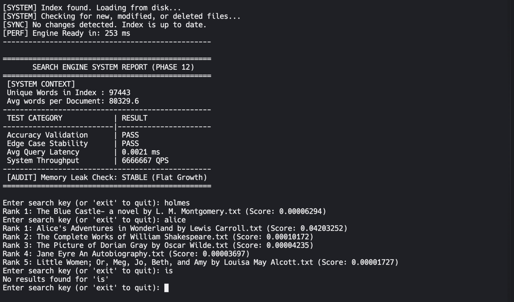

# 👻 Ghostlight — File-Based Search Engine in C++

A high-performance, file-based search engine built from scratch in C++ — no external libraries, no frameworks. Ghostlight indexes text documents, ranks results using TF-IDF scoring, and persists its index across sessions with automatic sync detection.

---

## 📸 Demo



---

## ⚡ Performance

| Metric | Result |
|---|---|
| Unique Words Indexed | 97,443 |
| Avg Words per Document | 80,329 |
| Avg Query Latency | 0.0017 ms |
| System Throughput | 9,090,909 QPS |
| Index Build Time (35 files, 8 threads) | ~1,300 ms |
| Engine Load Time (warm start) | ~130 ms |

> Tested on macOS with 35 Project Gutenberg books (~2.8M words total)

---

## 🚀 Features

- **Inverted Index** — O(1) keyword lookup using hash maps instead of brute-force scanning
- **TF-IDF Ranking** — mathematically ranks documents by term relevance, not just frequency
- **Persistent Storage** — serializes the full index to `index.txt` using a custom `|` delimited format that handles filenames with spaces
- **Incremental Sync Engine** — on every startup, detects new, modified, and deleted files using timestamp comparison and updates the index automatically without full rebuilds
- **Multi-Threaded Indexing** — splits files across `hardware_concurrency()` threads using thread-local maps to avoid data races, merges results after all threads join — fully lock-free design
- **Stop Word Filtering** — filters ~100 common English words (the, is, and...) during indexing, reducing average document word count by ~50%
- **File Scrubbing** — safely removes a deleted file's contributions from all index structures atomically
- **Automated Test Suite** — accuracy validation, edge case stability, query latency, and stress throughput tests on every startup

---

## 🏗️ Architecture

```
┌─────────────────────────────────────────────┐
│                 SearchEngine                │
│                                             │
│  ┌──────────┐    ┌──────────┐               │
│  │  Indexer │    │  Syncer  │               │
│  │  (MT)    │    │          │               │
│  └────┬─────┘    └────┬─────┘               │
│       │               │                     │
│  ┌────▼───────────────▼─────┐               │
│  │     Inverted Index       │               │
│  │  word → {file → freq}    │               │
│  └──────────────────────────┘               │
│                                             │
│  ┌──────────┐    ┌──────────┐               │
│  │TF-IDF    │    │Persistent│               │
│  │Ranker    │    │Storage   │               │
│  └──────────┘    └──────────┘               │
└─────────────────────────────────────────────┘
```

---

## 🧵 Multi-Threading Design

The indexing pipeline uses a **thread-local merge** strategy:

1. Files are collected into a vector and divided into `N` balanced chunks where `N = hardware_concurrency()`
2. Each thread receives a `start` and `end` index into the files vector
3. Each thread writes exclusively into its own `ThreadResult` struct — no shared state, no locks
4. After all threads `join()`, a single-threaded merge pass combines all `ThreadResult` slots into the global index using `+=` on nested maps

This design is completely **lock-free** during the heavy work (file I/O + word counting) and only requires a single sequential merge step.

---

## 📐 TF-IDF Scoring

```
TF  = word frequency in document / total words in document
IDF = log10(total documents / documents containing word) + 1
Score = TF × IDF
```

Words that appear frequently in one document but rarely across others score highest — this naturally surfaces the most relevant results.

---

## 🗂️ Index Format (`index.txt`)

```
word|filecount
filename1|frequency
filename2|frequency
$$$DOC_DATA$$$
filename|totalwords
$$$TIME_STAMPS$$$
filename|timestamp
```

The `|` delimiter was chosen specifically to handle filenames containing spaces, which the standard `>>` operator cannot parse correctly.

---

## 🔧 Build & Run

**Requirements:** C++17, g++ with `-lpthread`

```bash
# Compile
g++ -std=c++17 -O2 -lpthread main.cpp -o ghostlight

# Run
./ghostlight
```

Place your `.txt` files inside a `txt_files/` folder in the same directory. Currently indexed against 25 Project Gutenberg books. Place `stopwords.txt` in the root directory alongside the binary.

---

## 📁 Project Structure

```
ghostlight/
├── main.cpp            # Full engine source
├── stopwords.txt       # Stop word filter list
├── index.txt           # Auto-generated persistent index (do not commit)
└── txt_files/          # Your document collection (25 books)
```

---

## 🗺️ Roadmap

| Phase | Feature | Status |
|---|---|---|
| 1-3 | Brute force baseline | ✅ Done |
| 4-5 | Inverted index + query engine | ✅ Done |
| 6 | Basic frequency ranking | ✅ Done |
| 7 | Code architecture | ✅ Done |
| 8 | Testing & validation | ✅ Done |
| 11 | Persistent storage | ✅ Done |
| 12 | Multi-threaded indexing | ✅ Done |
| 13 | Stop word filtering | ✅ Done |
| 15 | Boolean & multi-word search | 🔄 In Progress |
| 16 | Performance & scalability analysis | 📋 Planned |

---

## 👤 Author

**Dhirendra Singh**
[GitHub](https://github.com/THAKUR-DHIRENDRA)
